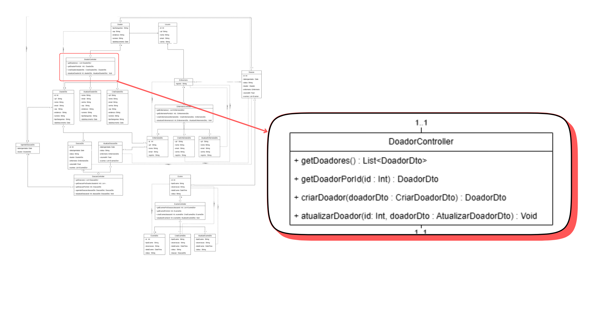

# Diagrama de Classe do APP DoeVida

O diagrama abaixo representa a modelagem das principais entidades, relacionamentos e responsabilidades do sistema de doação de sangue. Ele foi desenvolvido com o objetivo de organizar e estruturar a lógica do projeto, facilitando tanto o desenvolvimento quanto a manutenção futura.

Neste diagrama, é possível visualizar como os doadores, enfermeiros, doações, exames e agendamentos estão interligados, além da separação das responsabilidades em controllers e objetos de transferência de dados (DTOs). A modelagem reflete os processos reais envolvidos na gestão de doações, desde o cadastro de usuários até o acompanhamento dos exames realizados nas coletas.
## Controllers
São responsáveis por gerenciar as regras de negócio e as operações que envolvem as entidades do sistema. Cada controller cuida de um domínio específico, garantindo que as ações de cadastro, atualização, listagem e busca sejam executadas corretamente. A seguir, estão destacados individualmente os controllers e suas funções no contexto da aplicação.

### DoaçãoController

Responsável por gerenciar todas as operações relacionadas às doações de sangue. Isso inclui a criação, atualização, agendamento e listagem de doações, bem como a busca de doações específicas por ID ou por doador. Esse controller centraliza a lógica que garante o controle e o acompanhamento das doações realizadas no sistema.

### EnfermeiroController

Administra os dados dos enfermeiros que participam do processo de coleta e acompanhamento. Suas funcionalidades incluem cadastrar, atualizar e listar enfermeiros. Esses profissionais estão diretamente ligados tanto às coletas de sangue quanto aos exames, sendo fundamentais no fluxo do sistema.

### DoadorController

Responsável por gerenciar as operações relacionadas aos doadores. Ele permite cadastrar, listar, atualizar e buscar informações dos doadores no sistema. Além disso, controla dados como nome, CPF, tipo sanguíneo, endereço e informações de contato dos doadores.

### ExameController

Gerencia os exames realizados nas coletas de sangue. Por meio dele, é possível cadastrar um novo exame, listar todos os exames ou buscar por exames específicos vinculados a uma doação. Ele garante que o sistema acompanhe a qualidade e segurança das coletas, controlando informações como o tipo de exame, data, horário e status dos resultados.

